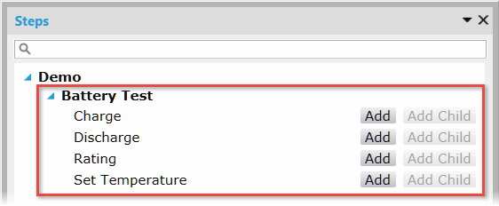
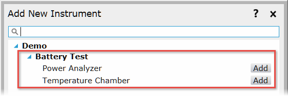
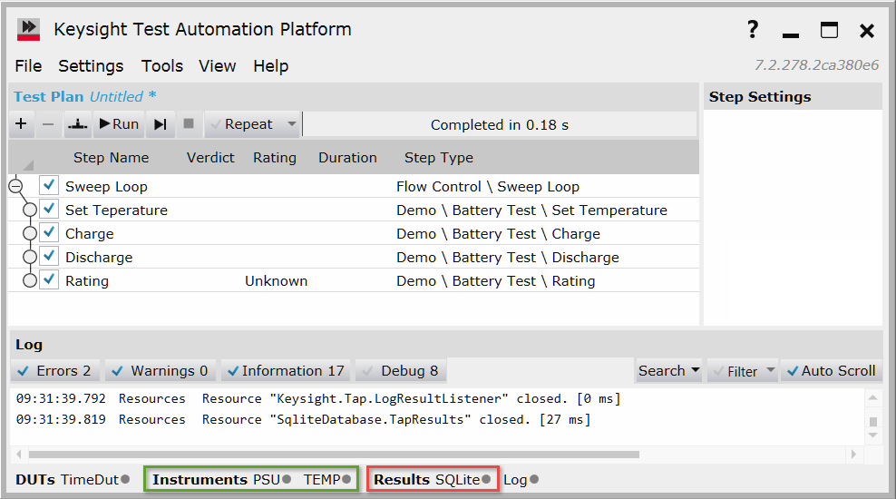
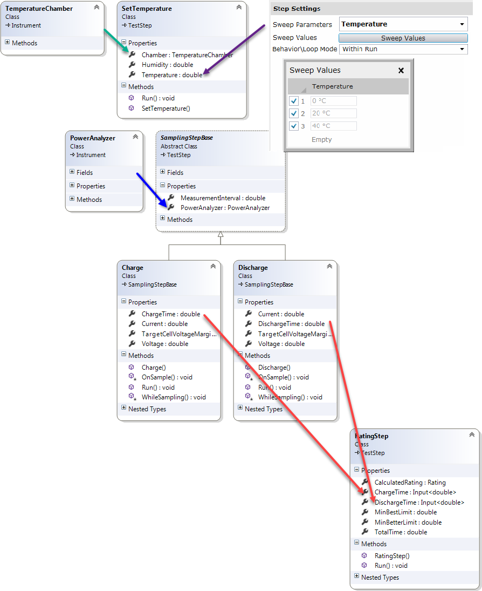

# Battery Demonstration Overview

The *OpenTap.Plugins.Demo.Battery.dll* contains resources that are useful in learning about Test Automation, including:

- Four test steps:

    

- Two simulated instruments:

    

See [Test Step Details](BatteryTestDemoDetails.md) for more information on these steps and instruments.

A typical test plan is shown below:

Notice that the test plan relies on two instruments (green box), and (preferably) as SQLite result listener (red box).

The test plan above shows a number of Test Automation features. For example:

- A **Sweep Loop** statement sweeps over the **Temperature** setting for the **Set Temperature** test step (purple arrow) 
- The **Set Temperature** test step requires a setting of type **Temperature Chamber** (green arrow) 
- The **Charge** and **Discharge** test steps require a setting of type **PowerAnalyzer**, which is defined in a base class (blue arrow) 
- The **Rating** step has **ChargeTime** and **DischargeTime** “input” settings that are matched to the “output” variables defined by the Charge and Discharge test steps (red arrows) 
 
