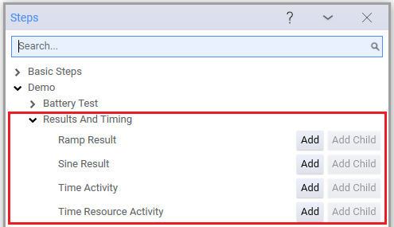
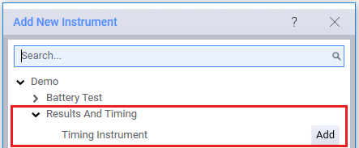
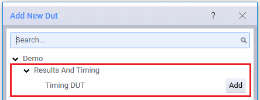

# Results and Timing Demonstration Overview

The *OpenTap.Plugins.Demo.ResultsAndTiming.dll* contains resources that are useful in learning how to use the Results Viewer and Timing Analyzer, including:

- Four test steps:

    

See the [test step details](ResultsAndTimingDemoDetails.md) for more information on these steps.

- One simulated instruments:

    

- One simulate DUT:

     

