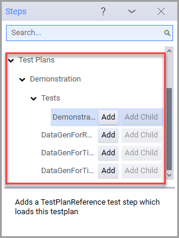
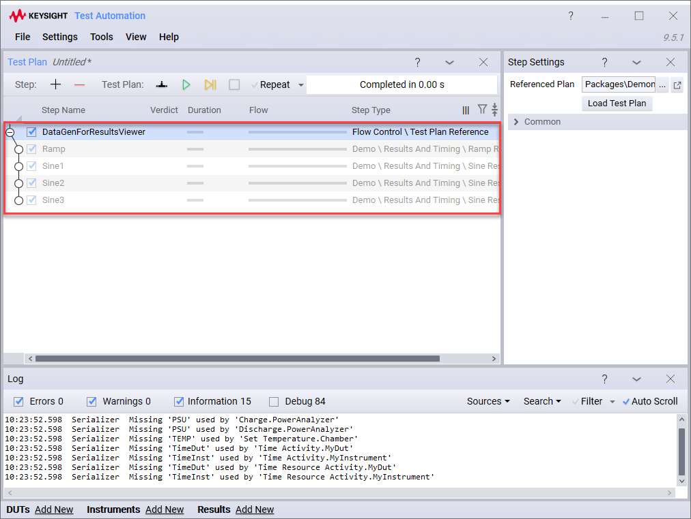

# Welcome

This plugin package contains a number of demonstration test steps, resources and test plans. This package contains:

- **[OpenTap.Plugins.Demo.Battery.dll](../Battery Test Demo/Readme.md)** — demonstration test steps and simulated instruments 

- **[OpenTap.Plugins.Demo.ResultsAndTiming.dll](../Results and Timing Demo/Readme.md)** — demonstration test steps and a simulated instrument

- **SampleLog.txt** — text file used for demonstration of Timing and Analyzer

- **DataGenForResultsViewer.TapPlan** — test plan that generates data to demonstrate how to use the Results Viewer

- **DataGenForTimingAnalysis.TapPlan** — test plan that generates data to demonstrate how to use the Timing Analyzer

- **DataGenForTimingAnalysisParallel.TapPlan** — test plan that generates data to demonstrate how to use the Timing Analyzer to analyze series and parallel operations

- **DemonstrationSource.zip** - a compressed file containing the source code for the Demonstration plugin

- **DemonstrationAllSteps.TapPlan** - a test plan that containing all the test step included in the plugin

- **Connections.xml** - test bench profile for connections

- **DUTs.xml** - test bench profile for DUTs

- **Instruments.xml** - test bench profile for instruments

In the **Steps** windows under the **Test Plans > Demonstrations** section you can find test steps that will load the included test plans: 

For example, adding the *DataGenForResultsViewer* test step will load the related test plan:

Note that you cannot edit the individual test steps in a test plan loaded this way.
